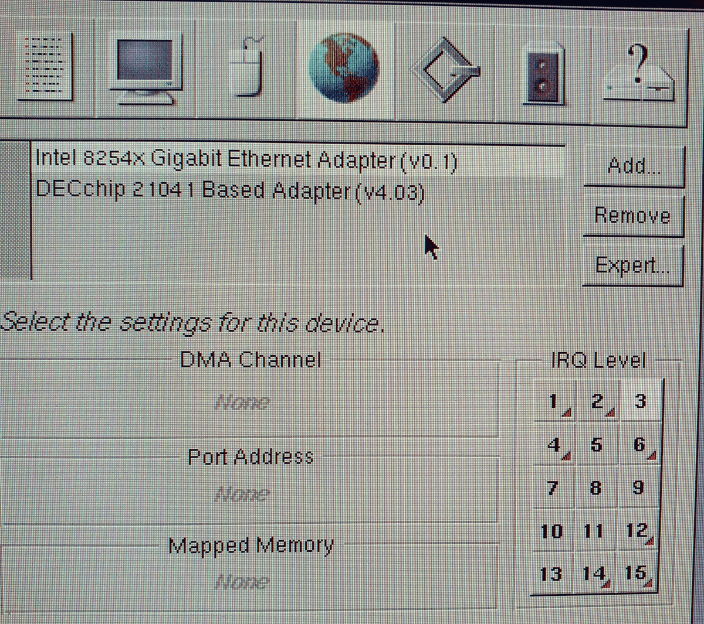

# openstep-intel1000

An OPENSTEP 4.2 / NeXTSTEP DriverKit driver for Intel 8254x gigabit
Ethernet controllers, written from scratch.

Verified on real hardware: an **Intel 82547EI** in a Fujitsu Intel 865G
machine: **145–172 Mbit/s transmit and 248 Mbit/s receive**, about 21×
the 10 Mb card it sits beside, over a 512 MB / 670k-packet load test.

```
$ ping 192.0.2.190
64 bytes from 192.0.2.190: icmp_seq=3 ttl=255 time=0.115 ms
4 packets transmitted, 4 received, 0% packet loss

nextonion# netstat -i
Name  Mtu   Network   Address        Ipkts Ierrs   Opkts Oerrs Coll
en1   1500  192.0.2   192.0.2.190   295902     0  377104     0    0
en1*  1500  none      none          295902     0       0     0    0
```

Both rows are the same interface, and the second is the one that carries
error counts — see "Where the error counts show up" below.

## Why this exists

OPENSTEP shipped in 1996 with drivers for the network cards of its day —
10 Mb parts. Gigabit Ethernet arrived years later, and no driver for it
was ever written for this operating system. This one closes that gap for
the PCI generation of Intel's gigabit controllers.

An earlier attempt on Linux had stalled on the PHY abstraction layer.
That turned out not to apply here: on the 8254x the MAC's internal PHY
runs clause 40 auto-negotiation by itself, so the driver only has to set
`CTRL.SLU|ASDE` and read back `STATUS`. Measured — the link comes up at
1000 Mb/s full duplex 1.3 s after a full device reset, with no MDIO
programming at all. Linux's phylib solves a *many MACs × many PHYs*
problem that a single-chip driver simply does not have.

## Status

| Area | State |
|------|-------|
| Link, reset, station address | Working |
| Receive (interrupt-driven, DMA ring) | Working |
| Transmit (interrupt-driven, DMA ring) | Working |
| Multicast filter (MTA hash) + promiscuous | Working, verified against the SDM's own worked example |
| Error accounting and ring-exhaustion recovery | Working, verified by driving the ring into overrun on purpose |
| Link change (cable out and back) | Working, verified with a two-minute unplug under load |
| Network stack integration (`enN`, ping, TCP) | Working |
| Boot-time auto-load | Working |
| Chip family beyond 82547EI | Implemented from the SDM and FreeBSD; **not tested on hardware** |
| Fiber / SerDes variants | Detected and refused — only the copper path is implemented |

Parts other than the 82547EI announce themselves in the log as
`[UNVERIFIED PART]`.

## Supported hardware

### Why PCIe cards are not supported

**OPENSTEP has no PCI Express support at all.** The operating system
predates PCIe by roughly seven years, and it ships bus drivers for
exactly three buses — the machine used here carries `EISABus.config`,
`PCIBus.config` and `PCMCIABus.config` in `/private/Drivers/i386`, and
nothing else. There is no PCIe bus driver to enumerate such a card, so
no device driver above it could ever be handed one.

This is not a limitation of this driver that could be lifted by adding
Intel's PCIe parts to its device table. A PCIe card in one of these
machines is invisible to the operating system; making it work would mean
writing a PCIe host bridge driver for OPENSTEP first, which is a
different and much larger project. Intel's PCIe gigabit controllers
(82571 onwards, and everything in the `e1000e` line) are therefore out
of scope, and they are also documented by a different manual with a
different initialisation sequence.

What remains — and what this driver covers — is the PCI/PCI-X 8254x
family, which one Intel manual covers as a whole.

### Chipset support matrix

**Tested on hardware — one part.**

| Device ID | Part | Notes |
|-----------|------|-------|
| `8086:1019` | **82547EI** | The card this was developed against. Onboard, CSA-attached, in a Fujitsu Intel 865G machine. Everything in the Status table above was measured on it. |

**Implemented and expected to work — not tested.** These share the
register set, descriptor formats and multicast hash with the 82547EI;
their per-part differences are handled explicitly and are cited to the
SDM or FreeBSD. They log `[UNVERIFIED PART]`.

| Device ID | Part | Per-part handling |
|-----------|------|-------------------|
| `8086:100E` | 82540EM | none needed |
| `8086:1015` | 82540EM (LOM) | none needed |
| `8086:1016` | 82540EP (LOM) | none needed |
| `8086:1017` | 82540EP | none needed |
| `8086:101E` | 82540EP (mobile) | none needed |
| `8086:1013` | 82541EI | PHY reset first, I/O-space reset |
| `8086:1018` | 82541EI (mobile) | PHY reset first, I/O-space reset |
| `8086:1014` | 82541ER (LOM) | PHY reset first, I/O-space reset |
| `8086:1078` | 82541ER | PHY reset first, I/O-space reset |
| `8086:1076` | 82541GI | PHY reset first, I/O-space reset |
| `8086:1077` | 82541GI (mobile) | PHY reset first, I/O-space reset |
| `8086:107C` | 82541PI | PHY reset first, I/O-space reset |
| `8086:1008` | 82544EI (copper) | none needed |
| `8086:100C` | 82544GC (copper) | none needed |
| `8086:100D` | 82544GC (LOM) | none needed |
| `8086:100F` | 82545EM (copper) | none needed |
| `8086:1026` | 82545GM (copper) | none needed |
| `8086:1010` | 82546EB (copper) | none needed |
| `8086:101D` | 82546EB (quad copper) | none needed |
| `8086:1079` | 82546GB (copper) | none needed |
| `8086:101A` | 82547EI (mobile) | PHY reset first, CSA IMS/IMC sequence |
| `8086:1075` | 82547GI | PHY reset first, CSA IMS/IMC sequence |

Of these, the **82540EM** and **82541PI** are the most likely to be
found as add-in PCI cards (PRO/1000 MT Desktop and PRO/1000 GT
respectively) and are the obvious candidates for the next verification.
The 82540EM needs no per-part handling at all, so it exercises the
least untested code.

**Detected and refused — fiber and SerDes.** See the section below for
why.

| Device ID | Part |
|-----------|------|
| `8086:1009` | 82544EI (fiber) |
| `8086:1011` | 82545EM (fiber) |
| `8086:1027` | 82545GM (fiber) |
| `8086:1028` | 82545GM (SerDes) |
| `8086:1012` | 82546EB (fiber) |
| `8086:107A` | 82546GB (fiber) |
| `8086:107B` | 82546GB (SerDes) |

**Out of scope — PCIe.** 82571, 82572, 82573, 82574, 82575, 82576,
the ICH/PCH integrated parts, and everything else in the `e1000e`
family. No PCIe bus exists for OPENSTEP to enumerate them on.

**Also out of scope — pre-8254x.** The 82542 (`8086:1000`) and 82543
(`8086:1001`, `8086:1004`) are an earlier generation with different
descriptor handling and their own errata. They are not in the device
table.

### Per-part differences

Handled with flags rather than assumptions:

| Flag | Parts | Source |
|------|-------|--------|
| `Q_PHY_RESET_FIRST` | 82541, 82547 | FreeBSD `e1000_reset_hw_82541()` gates exactly these two on `mac.type` |
| `Q_HUB_IMS` | 82547GI/EI | SDM 13.4.20 / 13.4.21, CSA message-ordering note |
| `Q_RESET_VIA_IO` | 82541 | Same function's `switch` — the part cannot acknowledge the 64-bit write a memory-space reset becomes |
| `Q_FIBER` | fiber / SerDes | Refused (see below) |

## Layout

```
README.md              this file
LICENSE                BSD 2-Clause
NOTICE                 what was consulted while writing this, and what
                       was not
dist/                  openstep-intel1000-src.tar — everything needed to
                       build on an OPENSTEP machine, nothing else required.
                       Not committed; regenerate with tools/make-dist.sh
NOTES.ko.md            detailed development notes and findings (Korean)
PLAN.md                original design and roadmap (Korean)
Configure_APP_SCREENSHOT.png
                       the driver as Configure.app shows it

Pro1000/               the driver bundle source
  Default.table          catalogue: which devices this driver claims
  Instance0.table        this machine's detected instance (PCI location, IRQ)
  README-Instance0.md    why that file carries the IRQ, and how to edit it
  English.lproj/         the names Configure.app shows
  Pro1000_reloc.tproj/   the kernel code
    Pro1000.m            the whole driver, ~2000 lines
    Load_Commands.sect   kern_loader directives (WIRE / START / DETACH)

doc/                   OPENSTEP driver development notes (Korean)
  driverkit.md           build chain, loading, interrupts, DMA, hazards
  workflow.md            edit-on-host / build-on-target cycle
  hardware.md            the test machine's inventory
pkg/                   Installer package: Pro1000.info + build-pkg.sh, and
                       the prebuilt Pro1000.pkg.tar (committed)
tools/                 host-side helpers (copies; shared with sibling work)
etc/site.conf.sample   site addresses template
perf/                  nxperf — throughput measurement, one source for both ends
pcils/                 pcils — an lspci for OPENSTEP, kernel module + front end
ref/                   third-party references (not committed; see ref/README.md)
```

## Building and installing

The driver is compiled **on the target** with NeXT cc 2.7.2.1. There is
no cross-compiler, so whatever route you take, the build happens on the
OPENSTEP machine itself.

### From the Installer package (.pkg)

The quickest install, if you have `pkg/Pro1000.pkg.tar` and do not want to
build anything: unpack it on the machine and double-click `Pro1000.pkg` —
Installer.app copies the driver bundle into `/private/Devices` (real path
`/private/Drivers/i386`):

```sh
gnutar xf .../openstep-intel1000/pkg/Pro1000.pkg.tar
open Pro1000.pkg
```

This only **installs** the bundle; it does not load it. Activate the
driver with **Configure.app** (add the Intel gigabit driver and set its
PCI instance / IRQ — see below), or reboot if it is already configured.
As with every route you must still tell the driver where your card is
(`Instance0.table`).

To rebuild the package itself on an OPENSTEP box:

```sh
./tools/nx-install-driver.sh openstep-intel1000/Pro1000 -n   # build Pro1000.config
sh pkg/build-pkg.sh /tmp/Pro1000/Pro1000.config pkg          # -> pkg/Pro1000.pkg(.tar)
```

The package is a plain `tar` with no gzip — its payload `Pro1000.tar.Z`
is already compressed.

### From the tarball, on the machine

The tarball is generated, not committed — build it with
`./tools/make-dist.sh` from this directory.

This is the short path if you have `dist/openstep-intel1000-src.tar` and
an OPENSTEP box. Nothing else from this repository is needed. The
tarball holds the driver source, `pcils` for finding your card, and
`nxperf` for measuring the result; it is a plain `tar` with no
compression, because the `tar` on these machines is old enough that
keeping things simple is worth more than the saved bytes.

Verified: extracted on OPENSTEP 4.2 and built with the commands below,
producing a `Pro1000_reloc` of 122412 bytes — byte for byte what a build
straight from this repository produces.

```sh
# on OPENSTEP, as root
tar xf openstep-intel1000-src.tar
cd Pro1000
make                                    # builds Pro1000.config/

cp -r Pro1000.config /private/Devices/
/usr/etc/driverLoader D=Pro1000         # probe and attach
```

**Before that will work you must tell the driver where your card is.**
`Instance0.table` in the tarball describes the machine this was
developed on; yours will differ:

```
"Location" = "Dev:1 Func:0 Bus:2";      ← your card's PCI location
"IRQ Levels" = "3";                     ← the IRQ your BIOS assigned
```

Both values come from the PCI bus. `pcils` (included) prints them:

```sh
cd pcils/PCIscan && make
cp -r PCIscan.config /private/Devices/
cd .. && cc -O -o pcils pcils.c && ./pcils
```

Look for the line naming your controller — the leading `bb:dd.f` is the
location and the `IRQ n` is the interrupt:

```
02:01.0 Ethernet controller [0200]: Intel 82547EI Gigabit Ethernet ...
        IRQ 3, pin A
        BAR0: mem 0xe8100000 (32-bit, non-prefetchable)
```

`"IRQ Levels"` is not optional, on any path. Without it the device description
reaches the driver carrying no interrupt, `-interruptOccurred` is never
called, and transmits complete in hardware while the driver waits
forever for a completion that cannot arrive.

### Configure.app is the intended editor for these values

Editing `Instance0.table` in a text editor is the manual route. The
supported one is **Configure.app**, which is the GUI front end for the
same file — it is where OPENSTEP expects a network card's IRQ to be
chosen.



The screenshot was taken at version 0.1; the same window now reads
`(v1.0)`. Everything else about it is current.

Three things in that window are worth reading carefully.

**The driver is listed by name.** `Intel 8254x Gigabit Ethernet Adapter`
comes from `"Long Name"` in `English.lproj/Localizable.strings`, and the
`(v0.1)` in the shot from `"Version"`, which now reads `1.0`. The key on the strings file's
first line has to match `"Server Name"` in `Default.table`. If the
strings are missing Configure.app has nothing to look up and displays
the key itself — this driver first appeared there as literally
`Long Name(v0.1)`.

**IRQ Level is live.** Choosing a cell writes `"IRQ Levels"` into
`Instance0.table` — the same key described above, and the one this
driver cannot work without. Nothing in the source needs to change for a
choice made here to take effect: the driver never names an IRQ itself,
it reads whatever the device description hands it. That is the whole
reason the value lives in a table instead of a `#define`. As with a hand
edit, the driver has to be reloaded to see the change.

**DMA Channel, Port Address and Mapped Memory read `None`** because
`Default.table` declares `"DMA Channels"`, `"I/O Ports"` and
`"Memory Maps"` as empty strings, and that is deliberate. An 8254x is a
bus master with a single memory BAR: it needs no ISA DMA channel, and it
maps its own register block at run time with
`IOMapPhysicalIntoIOTask()` using the address it reads from
configuration space. Declaring ranges the driver does not use would only
create conflicts for other cards to trip over.

One value in `Instance0.table` is **not** reachable from this window:
`"Location"`, the card's PCI bus/device/function. It has to be written
by hand from what `pcils` reports, which is why the manual route above
is still the one to follow on a new machine.

### Changing the tables does not need a rebuild

`Default.table` and `Instance0.table` are plain text inside the bundle.
Only `Pro1000_reloc` is compiled. Moving the driver to another machine
means building once, then editing the tables with that machine's values —
no recompile. The driver does have to be **reloaded** to read them,
which with `DETACH` in place means a reboot.

To load the driver at every boot, add its name to `"Active Drivers"` in
`/private/Devices/System.config/Instance0.table` — note that it is
`Instance0.table` that holds the live configuration; `Default.table`
beside it is only a template.

### From this repository, with the host toolchain

Edit on a Linux host, build on the target over NFS. This is the loop
used during development.

Run these from the workspace root, one level above this directory —
`nx-install-driver.sh` takes a path relative to the exported tree.

```sh
cp etc/site.conf.sample etc/site.conf     # fill in addresses
./tools/gen-conf.sh

sudo ./tools/serve-src.sh                 # export this tree over NFS
./tools/nx-mount.sh                       # mount it on the target
./tools/nx-daemon.sh start                # restart after every reboot

./tools/nx-install-driver.sh openstep-intel1000/Pro1000
```

`gcdsd` does not survive a reboot, and neither does the mount; both
lines above are part of restarting work, not just of setting it up.

The driver is activated at boot, so the way to pick up a new build is to
reboot — `Load_Commands.sect` carries `DETACH`, which makes unloading an
error by design.

`nx-install-driver.sh` refuses to install a zero-length bundle and
refuses to unload a driver that is already attached to the network
stack. Both refusals exist because the alternatives were discovered the
hard way: the first wedges `kern_loader` into a spin that survives until
reboot, the second panics the kernel.

To load at every boot, add the driver name to `"Active Drivers"` in
`/private/Devices/System.config/Instance0.table` — note `Instance0.table`,
not `Default.table`; the latter is only a template.

## Where the error counts show up

`netstat -i` prints two rows per interface, and **the error columns are
only populated on the second one** — the `enN*` row with no address:

```
Name  Mtu   Network     Address          Ipkts Ierrs   Opkts Oerrs Coll
en1   1500  192.0.2     192.0.2.190     299592     0  262457     0    0
en1*  1500  none        none            299592 214279       0     0    0
```

Both rows are the same interface. Reading only the row that carries the
address is an easy way to conclude the driver reports no errors when it
is in fact reporting a great many.

Those errors were produced deliberately, by flooding the interface with
UDP faster than a 16-descriptor ring can be drained. The driver logs its
own tally next to the interface's, so the two can be compared at the
same instant:

```
Pro1000: receive overrun 10700 (ICR 0x000000d3), 107471 missed
         106073 without a descriptor, if errors 213544
```

107471 + 106073 = 213544 — the driver's two counters account for the
interface's error total exactly. (The `netstat` snapshot above reads
214279 because it was taken a little later, after the flood had run on
past that log line.) `MPC` counts frames the receive FIFO had no
room for; `RNBC` counts frames that arrived when the ring had no free
descriptor. Neither ever reaches a descriptor, so neither can be seen
any other way. The hardware resumes on its own once descriptors free
up — there is nothing to reset — so what the driver adds is the record
that it happened.

## Losing the cable and getting it back

Tested by unplugging the gigabit port for two minutes while 16k
packets/s were going out of it:

```
07:16:11  Pro1000: link down - carrier lost, transmits will not
                   complete until it returns
07:18:17  Pro1000: carrier back - link UP, 1000Mb/s, full duplex
```

The interface came back at the full rate on its own, with no errors
recorded over the whole episode. Traffic took about a minute longer than
the cable did to resume, which is TCP's retransmit backoff and nothing
to do with the driver.

One expectation was wrong and is worth recording. The SDM says
"indication that the link is not up disables MAC operation", from which
it follows that transmits should stop completing and the driver's
watchdog should fire every three seconds. **It never fired once** in
those two minutes, with TCP retransmitting throughout. The descriptor
engine goes on consuming descriptors and writing them back without a
carrier; the frames are simply lost on the wire. The watchdog therefore
never escalates on a cable pull, and the guard against that is
defensive, not a fix for anything observed.

## Licence

BSD 2-Clause — see [LICENSE](LICENSE). The acknowledgements are in
[NOTICE](NOTICE).

The driver is original work. Intel's manual for the family is its
primary specification, and two BSD-licensed drivers were consulted while
writing it: FreeBSD's `sys/dev/e1000`, which is the only readily
available implementation covering the 82547, and Minix 3's, which is a
useful example of how little is required to drive one of these parts.
No code from either was copied, and neither is redistributed here.
NOTICE says exactly what each contributed; the source comments cite them
at the individual decisions.

Worth repeating from there, because it is the reason to trust the
register definitions: every offset in this driver was written down only
after FreeBSD's `e1000_regs.h` and Intel's manual agreed on it.

## Things worth knowing before changing this

Each of these cost a hung machine to learn. The reasoning is kept at the
relevant place in the source; this is the index.

**After asserting `CTRL.RST`, touch no register for about a second.**
The SDM says so plainly, and on a CSA-attached part the consequence of
ignoring it is not a wrong value but a dead machine: a read into a
resetting device never completes, and the CPU stalls on the bus with no
panic and no log. Ordinary PCI parts get away with a read-back here
because a non-responding target ends in a master abort; the CSA port has
no such escape.

**`-resetAndEnable:` runs in the network stack's context and must not
sleep.** `ifconfig` reaches it through an ioctl. Blocking there for
seconds — waiting for auto-negotiation, say — never returns to a usable
system. Long waits belong in `-initFromDeviceDescription:`, where
blocking is fine. Short settling uses `IODelay`, which busy-waits.

**Interrupts need three separate things to be right,** and each fails
silently on its own:

1. The device description must actually carry an interrupt.
   `[devDesc numInterrupts]` returning 0 means `-interruptOccurred` is
   never called, no matter what PCI configuration space says. The fix is
   `"IRQ Levels"` in `InstanceN.table`.
2. Chip-specific requirements. The 82547 signals interrupts as CSA hub
   messages rather than over a pin, and the SDM requires clearing IMS
   and IMC before asserting a mask — otherwise message reordering leaves
   the APIC believing the line is de-asserted while it is asserted, and
   the manual's own words for that are *"causes a system dead lock"*.
3. The framework's IRQ must be re-enabled at the end of the handler.
   DriverKit's default handler disables the interrupt when it posts the
   message and expects the driver to restore it. Without this, exactly
   one interrupt ever arrives; the causes pile up in `ICR` and are
   delivered all at once the next time something re-enables.

**`IOMalloc` guarantees neither physical contiguity nor alignment.**
DMA memory goes through `allocDmaBlock()`, which allocates twice what is
needed, uses whichever half does not straddle a page, and then verifies
on the physical side that the end of the block really is start + size −
1. A wrong address here does not fail — it makes the card write into
someone else's memory.

**Turn the engines off and confirm it before freeing their rings.** The
descriptor ring points at memory that is about to be returned to the
kernel.

**Never unload a driver that has attached to the network stack.** The
kernel holds pointers into the module; the documentation says the system
panics, and it does. `Load_Commands.sect` carries `DETACH` so that
`kl_util -u` fails instead of crashing, which means driver changes need
a reboot.

## Fiber and SerDes parts are refused

Copper parts negotiate through an internal PHY (SDM §8.5); fiber and
SerDes parts use the MAC's own clause 37 PCS (§8.6). The manual's
footnotes draw the line explicitly:

> §8.5 — *"82541xx, 82547GI/EI, and 82540EP/EM only."*
> §8.6 — *"Applicable to the 82546GB/EB, 82545GM/EM, and 82544GC/EI only."*

Only the copper path is implemented, so fiber parts are identified and
initialisation stops. A link that never comes up is easier to diagnose
than one that appears to work and quietly drops frames.

## On the code that could not be tested

Only the 82547EI has been in a slot. Everything else follows from the
SDM and FreeBSD's per-part code, and is written so that being wrong is
loud rather than quiet:

- The I/O window is found by scanning the BARs rather than assuming
  BAR2. That assumption holds on the 82547EI and would be a silent trap
  on a part where it does not.
- The I/O-space reset the 82541 needs is attempted only after checking
  that an I/O BAR exists *and* that PCI I/O decoding is enabled. Writing
  through a window the BIOS never opened would touch ports belonging to
  some other device — not a risk worth taking on hardware nobody can
  test.
- Unknown vendors and unknown devices are refused rather than driven on
  the assumption that they are close enough.

## Tools built along the way

Both are generally useful for OPENSTEP driver work, not just this
driver.

**`pcils`** — an `lspci` for OPENSTEP. Userland on this system cannot
execute `IN`/`OUT` (verified: `SIGILL`), so PCI configuration space can
only be walked from kernel context. It is a loadable kernel module that
dumps the bus through `IOLog` plus a userland front end that harvests and
formats it, writing to stdout or a file.

**`nxperf`** (in the tarball as `nxperf.c`) — bulk TCP throughput, one
source compiling on both Linux and OPENSTEP. Built rather than borrowed so that the known-good 10 Mb
card and the new gigabit card could be measured by the identical program
over the identical path, leaving the card as the only difference between
runs.

## References

Primary source is Intel's *PCI/PCI-X Family of Gigabit Ethernet
Controllers Software Developer's Manual* (the 82547xx is named on its
cover). Implementation cross-checks come from FreeBSD's `em(4)` and
Minix 3's `e1000`, both BSD-licensed; Linux's driver is GPL and was not
used. DriverKit specifics come from the NeXT documentation on the
machine itself. See `ref/README.md` for how to obtain each.
